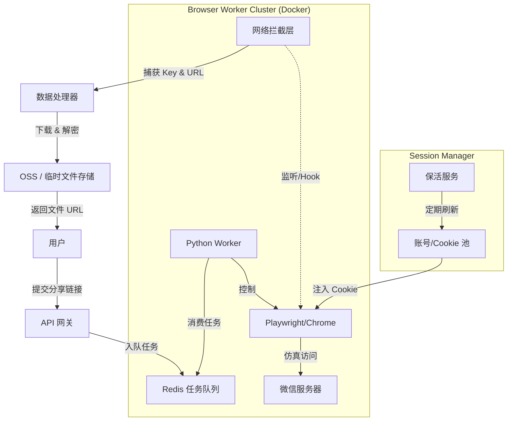

# 微信视频号分享链接服务端解析与下载服务详细设计

## 1. 方案背景与目标

**目标**: 实现一个不需要用户安装证书、不需要配置代理的“傻瓜式”下载体验。
**场景**: 用户在微信手机端浏览视频 -> 点击“分享” -> “复制链接” -> 发送给我们的服务（Telegram Bot、微信机器人或网页输入框） -> 服务返回下载地址或直接推送文件。

**核心挑战**: 微信视频号链接（`channels.weixin.qq.com`）通常强依赖微信客户端环境或已登录的 Web 态 Cookie，服务端直接 `curl` 无法获取有效数据。因此，必须构建一个**基于无头浏览器 (Headless Browser) 的仿真渲染集群**。

## 2. 总体架构设计

采用 **Producer-Consumer** 模型，前端 API 接收任务，后端 Browser Worker 异步处理。



## 3. 核心模块详细设计

### 3.1 账号与会话管理系统的设计 (Session Manager) - **最关键环节**

由于视频号 Web 端必须登录才能完整浏览，服务端必须维护一个“活跃账号池”。

*   **账号来源**: 管理员扫码登录，将 Cookie 持久化。
*   **Cookie 结构**: 重点关注 `wx_channels_token` 等鉴权字段。
*   **保活策略 (Keep-Alive)**:
    *   Playwright 脚本每隔 1-2 小时后台自动访问主页，触发 Token 刷新。
    *   若 Cookie 失效，通过通知系统（钉钉/飞书）报警，人工重新扫码。
    *   **高级方案**: 多账号轮询，避免单账号高频访问触发风控。

### 3.2 仿真与数据提取 (Browser Worker)

使用 **Playwright (Python)** 替代 Selenium，因为其抗指纹能力更强，网络拦截更方便。

**流程逻辑**:

1.  **初始化 Context**:
    ```python
    context = await browser.new_context(
        user_agent="Mozilla/5.0 ... Wechat...", # 模拟微信 PC 端 UA
        storage_state="auth.json" # 注入登录态
    )
    ```

2.  **注入提取脚本 (Preload Script)**:
    无需复杂的 MITM 代理，直接利用 Playwright 的 `page.add_init_script` 注入 Hook 代码，劫持 `XMLHttpRequest` 或监听 `window` 对象。
    
    *   **目标 1: 视频分片请求**: 监听网络请求中包含 `video_url` 或 `.mp4` 的链接。
    *   **目标 2: 解密 Key**: Hook `wasm` 加载或 JS 中的解密函数调用。由于 Web 端视频号通常也使用 WASM 进行播放/解密，我们需要 Hook `window.WeixinJSBridge` 或相关全局变量。
    
    *   **更简单的 Hacker 路径**:
        Web 版视频号页面通常在 HTML 的 `<script>` 标签中包含 `window.__DATA__` 或类似变量，里面直接含有未加密的 `url` 和 `decode_key`。
        **设计**: 页面加载完成后，直接执行 `page.evaluate("window.__DATA__")` 尝试获取元数据。

3.  **页面访问**:
    `await page.goto(shared_link)`
    等待特定元素加载（如 `<video>` 标签）。

### 3.3 下载与解密服务 (Downloader)

服务端获取到 `url` 和 `key` 后，不能直接返回给用户（因为用户通过普通浏览器访问不到内网视频流，或者不会解密）。必须由服务端代理下载。

*   **流式转发**:
    *   服务端建立到微信 CDN 的连接。
    *   实时读取流 -> 实时 ISAAC64 解密 -> 实时传输给用户（Pipe Response）。
    *   **优点**: 不占用服务端大量磁盘空间，响应快。
*   **异步下载 (对于大文件)**:
    *   下载并解密保存到临时目录。
    *   上传到对象存储 (OSS)。
    *   返回有效期 10 分钟的下载链接。

## 4. 接口定义 (API Specification)

### 4.1 提交解析任务
`POST /api/v1/parse`
```json
{
  "url": "https://channels.weixin.qq.com/web/pages/feed?LinkId=..."
}
```
**Response**:
```json
{
  "task_id": "task_123456",
  "status": "processing",
  "eta": 5 
}
```

### 4.2 查询任务结果
`GET /api/v1/task/{task_id}`
**Response**:
```json
{
  "status": "success",
  "data": {
    "title": "视频标题",
    "author": "创作者名称",
    "cover": "http://...",
    "download_url": "http://our-server.com/download/file_xyz.mp4", 
    "size_mb": 15.4
  }
}
```

## 5. 风控对抗与可行性提升 (Risks & Mitigations)

针对 **40/100** 的低可行性评分，提出解决方案：

### 5.1 验证码与反爬 (Anti-Crawling)
*   **问题**: 频率过高会触发滑块验证码。
*   **对策**:
    *   接入第三方打码平台（如 2Captcha），通过 Playwright 获取滑块图片自动验证。
    *   **IP 代理池**: 每次请求轮换 IP，模拟真实用户分布。

### 5.2 链接有效期 (Link Expiration)
*   **问题**: 分享链接可能在一段时间后失效。
*   **对策**: 提示用户生成链接后尽快提交。

### 5.3 登录态维护成本
*   **问题**: 只有个人维护的小型服务可以通过手动扫码维护 Cookie，作为商业化或公开服务很难扩展。
*   **对策 (On-Demand Login)**:
    *   当 Cookie 池耗尽或失效时，服务端生成一个新的登录二维码，通过 API 返回给用户：“请扫码授权解析”。
    *   用户扫码后，服务端获得 Session，利用该用户的 Session 解析他想看的视频。这相当于“用用户的身份帮用户爬虫”。

## 6. 实施步骤

1.  **原型验证 (PoC)**:
    *   编写一个简单的 Python 脚本，使用 Playwright 加载本地 Cookie，访问一个视频号链接，打印 `window.__DATA__`。验证能否提取到高清视频地址。
2.  **ISAAC64 集成**:
    *   复用 `task_20251215_001.md` 中提到的 Python 版解密算法（假设 Web 版加密逻辑与 PC 版一致，如果不一致需重新逆向 Web 版 JS/WASM）。
3.  **Worker 封装**:
    *   使用 Celery 或 RQ 封装 Playwright 任务。
4.  **服务部署**:
    *   Dockerfile 编写（需包含 Chromium 依赖）。

## 7. 结论

服务端解析方案虽然技术复杂度高（涉及无头浏览器、Session 养号、风控对抗），但用户体验是最好的。
**推荐**: 作为一个高级功能（Premium Feature）提供，或者作为 PC 本地代理模式的补充。初期建议采用 **PC 代理模式（task 001）** 快速落地，待稳定后再探索服务端模式。
