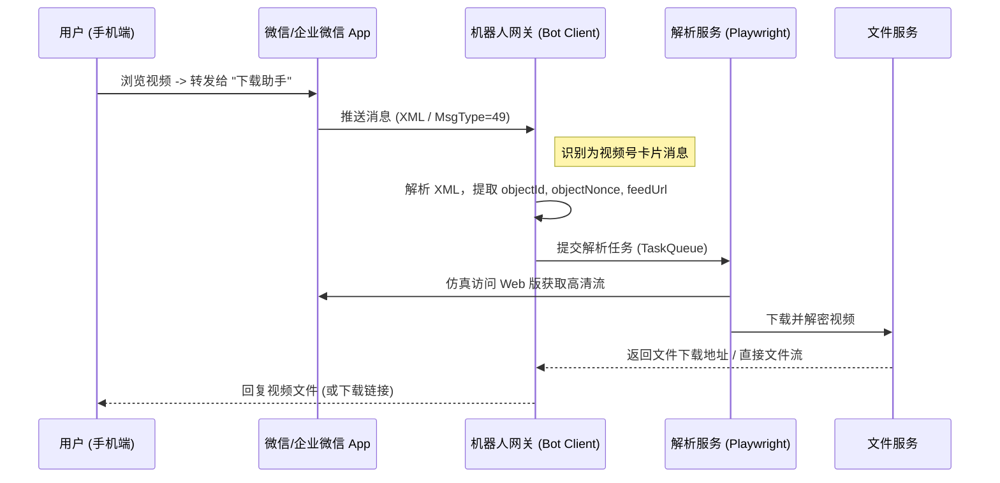

# 适配“转发给好友/企业微信”的机器人接入方案

## 1. 业务场景修正

基于微信的限制，视频号内容通常无法直接获取“纯文本链接”，用户最自然的操作路径是 **“转发给朋友”** 或 **“分享到企业微信”**。

因此，我们的服务入口不再是简单的“Web 输入框”，而必须是一个 **能够接收消息的“聊天机器人”**。

## 2. 交互流程设计



## 3. 接入端技术选型

由于需要接收“分享卡片”消息，我们将方案分为 **个人微信** 和 **企业微信** 两种路径。

### 3.1 方案 A：企业微信机器人 (推荐：稳定/合规)
利用企业微信的 **“自建应用”** 功能。
*   **优点**: 官方 API，不封号，部署简单。
*   **适用人群**: 拥有企业微信的公司/团队，或者个人注册一个测试企业。
*   **流程**:
    1.  后台创建“自建应用”（如：视频号助手）。
    2.  配置 **API 接收消息**（开启回调模式）。
    3.  用户在微信（个人号）添加企业微信号为好友，或在企微内部直接发送。
    4.  **难点**: 企微 API 接收到的视频号消息可能被阉割，只显示 `MsgType: External` 或加密数据。**需要验证 API 能否获取到 XML 中的 `url` 字段**。
        *   *调研*: 企微 API 通常可以拿到 `AppMsg` 结构，其中 `url` 往往指向视频号的 Web 落地页。

### 3.2 方案 B：个人微信 Hook/协议 (风险：中/高)
利用第三方框架接入个人微信号。
*   **技术栈**: **Wechaty** (配合 PadLocal/WechatY 等 Puppet)、**Gewechat** 等。
*   **优点**: 体验最原生，直接发给“文件传输助手”或某个好友即可。
*   **处理逻辑**:
    *   监听消息类型 `Message.Type.VideoChannel` (或 `UrlLink` / `AppMsg`)。
    *   从消息 Payload 中提取 XML。
    *   关键字段提取：
        ```xml
        <appmsg appid="" sdkver="0">
            <title>视频标题</title>
            <url>https://channels.weixin.qq.com/web/pages/feed?LinkId=...</url>  <!-- 关键目标 -->
            <finderFeed>
                <objectId>...</objectId>  <!-- 视频唯一ID -->
                <objectNonce>...</objectNonce>
            </finderFeed>
        </appmsg>
        ```

## 4. 详细解析策略 (XML to Data)

机器人接收到 XML 后，核心任务是构造出一个 **可供服务端 Playwright 访问的 URL**。

### 4.1 提取 URL
标准的视频号分享卡片 XML 通常包含 `<url>` 标签，其值为：
`https://channels.weixin.qq.com/web/pages/feed?LinkId=...` 或 `https://findermp.weixin.qq.com/...`
这个 URL 可以直接喂给我们的 **服务端解析模块 (Task 002)**。

### 4.2 兜底策略 (只有 ID 没有 URL)
如果消息中只有 `<objectId>` 和 `<objectNonce>`，我们需要手动拼接 Web URL：
*   **拼接格式**: `https://channels.weixin.qq.com/web/pages/feed?objectId={objectId}&objectNonce={objectNonce}`
*   注意：有时需要 `exportId` (导出ID) 才能在 Web 端访问。如果拼接链接无效，必须通过 **Bot 所在的手机/客户端** 进行更底层的 Hook 获数据（这回到了 Task 001 的 PC 代理模式）。
    *   *优化*: 如果 XML 里有 `username` (finderUsername), 也可以尝试访问博主主页进行搜索。

## 5. 文件回传体验优化

当解析并下载完成后，如何发给用户？

1.  **小于 100MB (部分平台 25MB)**:
    *   **直接发送文件**: 体验最好。用户点击即看，可保存。
    *   企业微信 API 支持上传素材 (`media/upload`) 并发送。
2.  **大文件**:
    *   **发送临时链接**: “视频较大，请点击链接下载（10分钟有效）：http://myserver/file/xyz.mp4”。
    *   **小程序卡片**: 配合一个小程序，点击直接在小程序内播放/下载（开发成本较高）。

## 6. 移动端落地总结 (Revised)

结合 Task 003 的机器人方案，移动端“真实落地”的最优解变为：

1.  **用户操作**: 手机上点分享 -> 发送给“小助手”（企业微信自建应用）。
2.  **后台处理**:
    *   “小助手” Server 接收 XML。
    *   提取 URL。
    *   扔给 Headless Browser (需登录态保活) 抓取流。
    *   从 CDN 下载流并解密。
3.  **反馈**: “小助手”把 `.mp4` 文件发回聊天窗口。

此方案**完全不需要用户安装代理或证书**，真正实现了“傻瓜式”移动端落地。
